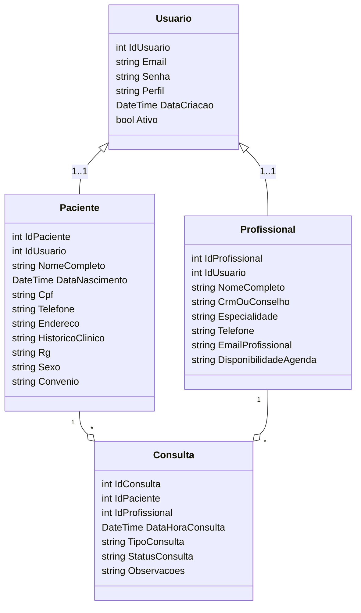

# Projeto SGHSS (Sistema de Gestão Hospitalar e de Serviços de Saúde)

Autor: [Seu Nome] — RU: [Seu RU]
Polo: [Seu Polo] — Semestre: [Semestre]

Data: 21/10/2025

---

## Sumário
1. Introdução
2. Requisitos (funcionais e não funcionais)
3. Modelagem e Arquitetura
4. Implementação (prototipagem)
5. Plano de Testes e Qualidade
6. Conclusão
7. Referências
8. Anexos (diagramas, coleções e prints)

---

## 1. Introdução
O SGHSS tem como objetivo apoiar a instituição VidaPlus na gestão de pacientes, profissionais, agendas e consultas, e servir de base para evoluções como telemedicina e administração hospitalar. Este documento apresenta a visão do projeto com ênfase em Back-end (API .NET 8 + EF Core + SQL Server), cobrindo requisitos, modelagem, endpoints, testes e materiais de apoio.

Principais usuários: Pacientes, Profissionais de Saúde e Administradores.

## 2. Requisitos

### 2.1 Requisitos Funcionais (RF)
| ID   | Descrição | Prioridade |
|------|-----------|------------|
| RF001 | Cadastrar e autenticar usuários (JWT) | Alta |
| RF002 | Gerenciar dados de Pacientes (CRUD parcial) | Alta |
| RF003 | Gerenciar dados de Profissionais (listar, detalhar, atualizar, excluir) | Alta |
| RF004 | Agendar e gerenciar Consultas com regras de conflito | Alta |
| RF005 | Controle de acesso por perfil (PACIENTE, PROFISSIONAL, ADMIN) | Alta |

### 2.2 Requisitos Não Funcionais (RNF)
| ID   | Descrição | Prioridade |
|------|-----------|------------|
| RNF001 | Segurança: autenticação via JWT e hash de senhas (BCrypt); aderência LGPD | Alta |
| RNF002 | Desempenho: respostas rápidas para operações críticas (agendamento/consulta) | Média |
| RNF003 | Escalabilidade: preparada para múltiplas unidades | Média |
| RNF004 | Disponibilidade: logs e migrações controladas | Média |
| RNF005 | Usabilidade: API autodescritiva e coleção Insomnia | Média |

## 3. Modelagem e Arquitetura

### 3.1 Diagrama de Classes (simplificado)

### 3.2 DER (conceitual)
- Tabelas: Usuarios, Pacientes, Profissionais, Consultas.
- Relacionamentos: Usuario-\>Paciente (1:1), Usuario-\>Profissional (1:1), Paciente-\>Consulta (1:N), Profissional-\>Consulta (1:N).
- Índices únicos: Usuarios.Email, Pacientes.Cpf, Profissionais.CrmOuConselho.

### 3.3 Arquitetura
- Monolito .NET 8 Web API.
- Camadas: Controllers -> Services -> DbContext/Entities.
- Autenticação JWT; Autorização por Roles.
- Migrations EF Core com baseline; seed de ADMIN no startup.
- CORS habilitado para front-ends locais.

## 4. Implementação (prototipagem)
- Linguagem/Stack: C#, ASP.NET Core 8, EF Core (SQL Server), JWT, BCrypt.
- Endpoints principais:
  - Auth: POST /api/Auth/login, POST /api/Auth/register
  - Pacientes: GET/GET{id}/PUT/DELETE
  - Profissionais: GET/GET{id}/PUT/DELETE
  - Consultas: POST/GET/GET{id}/PUT/DELETE
- Regras de negócio: conflitos de agenda, escopo por perfil, atualizações de status conforme regra.
- Coleção Insomnia: `assistiveFiles/Insomnia_SGHSS.json`

## 5. Plano de Testes e Qualidade
- Estratégia:
  - Funcionais: validar cada RF via Insomnia (coleção pronta) e casos definidos.
  - Não Funcionais: orientações para futura execução com JMeter/Locust (carga) e OWASP ZAP (segurança).
- Casos (exemplos): ver `assistiveFiles/TestPlan_SGHSS.md`.
- Logs: logs integrados do ASP.NET Core, possibilidade de evoluir para Serilog (futuro).

## 6. Conclusão
Foi desenvolvida uma API funcional cobrindo cadastro/autenticação, pacientes, profissionais e consultas, com regras de autorização e conflitos. Foram preparados baseline de migrations, seed de ADMIN e uma coleção do Insomnia. Próximas melhorias: auditoria LGPD, paginação/filtros, monitoramento e testes automatizados.

## 7. Referências
- Documentação ASP.NET Core, EF Core, JWT, OWASP Top 10, LGPD.
- Microsoft Docs, OWASP Cheat Sheets, Bcrypt.NET.

## 8. Anexos
- Diagramas (mermaid acima)
- Coleção Insomnia: `assistiveFiles/Insomnia_SGHSS.json`
- Plano de Testes: `assistiveFiles/TestPlan_SGHSS.md`

---

Observação: Para gerar o PDF final, exporte este arquivo com sua ferramenta preferida (ex.: VSCode + extensão Markdown PDF, ou Pandoc).
